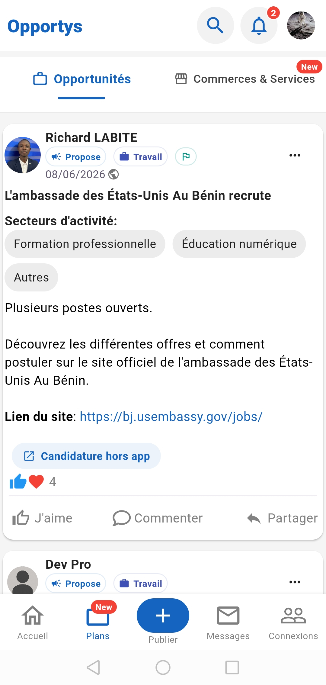
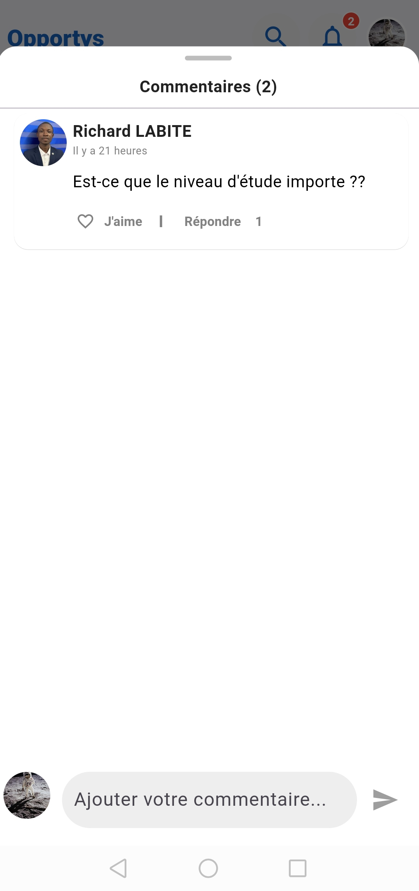
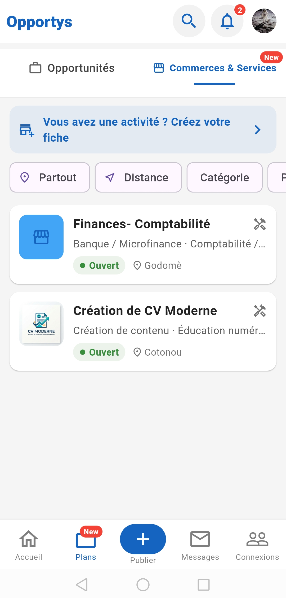
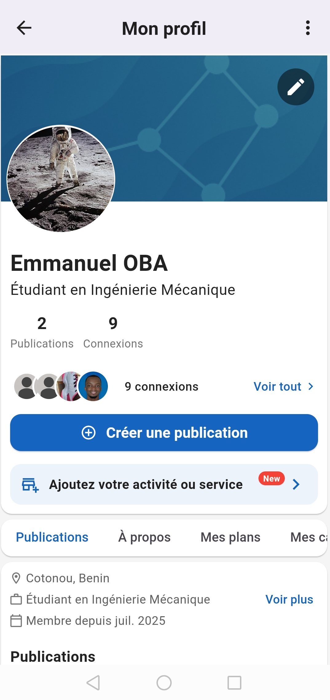
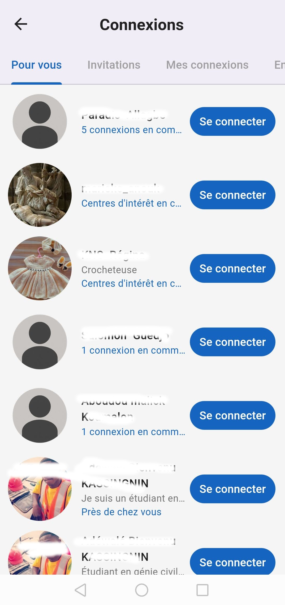
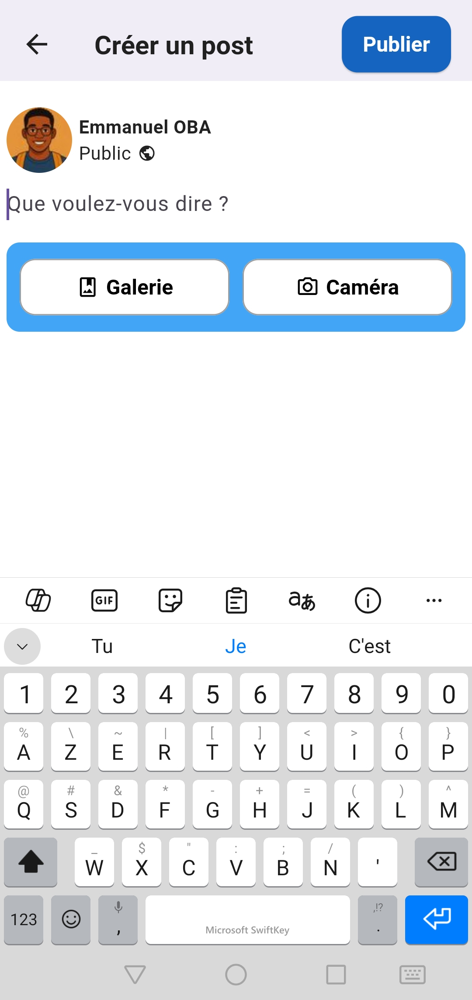

<p align="center">
  
</p>

<h1 align="center">Opportys</h1>

<p align="center">
  <b>Réseau social professionnel pour les talents</b>
  <br>
  Connecter. Partager. Saisir les opportunités.
</p>

<p align="center">
  <a href="https://play.google.com/store/apps/details?id=com.opportys">
    
  </a>
  
  
  
  
  
  
  
  
</p>

---

## Présentation

**Opportys** est un réseau social professionnel mobile qui connecte les professionnels, freelances, étudiants et artisans. Les utilisateurs peuvent publier des opportunités, découvrir des publications, construire leur réseau professionnel et échanger en temps réel — le tout dans une seule application.

> **Statut :** En ligne sur Google Play

---

## Captures d'écran

| Onboarding | Fil d'actualité | Opportunités | Commentaires |
|---|---|---|---|
|  |  |  |  |

| Marketplace | Profil | Connexions | Publier |
|---|---|---|---|
|  |  |  |  |

---

## Démo vidéo

<a href="https://youtube.com/shorts/RlI4S5zDWko">
  
</a>

---

## Fonctionnalités clés

### Fil d'actualité
- Fil personnalisé avec publications et offres d'emploi
- Création de posts texte, image et vidéo
- Like, commentaire (threadé), partage
- Hashtags avec détection des tendances
- @mentions avec autocomplétion

### Réseau professionnel
- Système de connexion bilatéral (demande/acceptation)
- Profil avec détails professionnels, domaines d'activité, localisation
- Statistiques et suivi des vues de profil
- Suggestions de connexions

### Messagerie temps réel
- Chat WebSocket via Socket.IO
- Accusés de lecture et indicateurs de saisie
- Envoi d'images dans les messages
- Détection de présence en ligne/hors ligne

### Offres d'emploi et opportunités
- Assistant de création d'offre en plusieurs étapes
- Dépôt de CV et gestion des candidatures
- Catégorisation par domaine d'activité
- Filtrage par localisation

### Marketplace
- Fiches commerces et services (produits et/ou services)
- Établissements géolocalisés avec PostGIS
- Galerie photo, logo, image de couverture, horaires d'ouverture
- Recherche à proximité avec filtrage par rayon

### Recherche
- Recherche full-text avec Typesense
- Filtres par facettes (type, domaine d'activité, hashtag)
- Recherche géographique avec tri par proximité
- Historique de recherche avec autocomplétion

### Notifications
- Notifications push via Firebase Cloud Messaging
- Fil de notifications in-app
- Notifications email
- Paramètres de notification configurables par type

### Sécurité
- Firebase Authentication + JWT
- Firebase App Check (Play Integrity)
- Détection d'images NSFW
- Mise sur liste noire des tokens via Redis

---

## Stack technique

### Backend — 12 microservices

| Service | Technologie | Responsabilité |
|---|---|---|
| **auth** | NestJS | Vérification Firebase, JWT, OTP, réinitialisation mot de passe |
| **user** | NestJS + Socket.IO | Profils, connexions, messagerie temps réel |
| **post** | NestJS | Publications, commentaires, likes, offres d'emploi, hashtags |
| **feed** | NestJS | Fil d'actualité personnalisé |
| **notification** | NestJS | Notifications push, email, in-app |
| **mailer** | NestJS (gRPC) | Envoi d'emails transactionnels |
| **media** | NestJS | Upload images/PDF, validation, redimensionnement Thumbor |
| **search** | NestJS | Recherche full-text Typesense + recherche géographique |
| **marketplace** | NestJS | Fiches commerces avec géolocalisation |
| **countrycity** | NestJS | Données géographiques de référence (pays/villes) |
| **dynamiclink** | NestJS | Génération de liens profonds pour le Play Store |
| **safe-image-checker** | Python FastAPI | Détection NSFW |

### Frontend

| Couche | Technologie |
|---|---|
| **Framework** | Flutter (Android, iOS, Web, Desktop) |
| **State Management** | BLoC + Cubit |
| **Routing** | GoRouter |
| **DI** | GetIt |
| **Réseau** | Dio + Socket.IO |
| **Cartes** | OpenStreetMap (flutter_map) |

### Infrastructure et DevOps

| Composant | Détails |
|---|---|
| **Base de données** | PostgreSQL + PostGIS |
| **Cache** | Redis |
| **Messagerie asynchrone** | Apache Kafka |
| **Moteur de recherche** | Typesense |
| **Conteneurisation** | Docker + Docker Compose |
| **CI/CD** | GitHub Actions → GHCR → VPS |
| **Serveur d'images** | Thumbor (redimensionnement à la demande) |
| **Authentification** | Firebase Auth |

### Schéma d'architecture

```
Application Flutter
    │
    ▼ HTTPS / WebSocket
  Passerelle Nginx
    │
    ├──► auth
    ├──► user (REST + WebSocket chat)
    ├──► post
    ├──► feed
    ├──► notification ──► gRPC ──► mailer
    ├──► media
    ├──► search
    ├──► marketplace
    ├──► countrycity
    └──► dynamiclink
           │
    ┌──────┴────────┐
    │ PostgreSQL    │
    │ Redis         │
    │ Kafka         │
    └───────────────┘
```

---

## Modes de communication

| Mode | Protocole | Usage |
|---|---|---|
| **REST** | HTTP/HTTPS | Opérations CRUD entre l'app et les services |
| **Asynchrone** | Kafka | Notifications, indexation recherche, recommandations |
| **Synchrone** | gRPC | Appels au service d'emails |
| **Temps réel** | WebSocket (Socket.IO) | Messagerie avec détection de présence |

---

## Structure du projet

```
backend/                         # Monorepo backend (Nx + NestJS)
├── apps/
│   ├── auth/         service
│   ├── user/         service
│   ├── post/         service
│   ├── feed/         service
│   ├── notification/ service
│   ├── mailer/       service (gRPC)
│   ├── media/        service
│   ├── search/       service
│   ├── marketplace/  service
│   ├── countrycity/  service
│   └── dynamiclink/  service
├── libs/
│   └── shared/       # Entités, repositories, DTOs, guards partagés
├── docs/             # Documentation architecture, déploiement, features
├── docker-compose.yaml
└── .github/workflows/

frontend/                        # Application Flutter
├── lib/
│   ├── features/      # 16 modules fonctionnels
│   ├── blocs/         # BLoCs partagés
│   ├── repositories/  # Repositories API
│   ├── services/      # Services métier
│   ├── widgets/       # Widgets réutilisables
│   └── di/            # Injection de dépendances
├── docs/
└── pubspec.yaml

safe-image-checker/              # Service de détection NSFW
├── app.py             # Service FastAPI
├── Dockerfile
└── docker-compose.yml
```

---

## Chiffres clés

- **11 microservices NestJS** + 1 service Python
- **43 entités de base de données**
- **16 modules fonctionnels Flutter**
- **50+ routes nommées**
- **14 repositories, 22 services**
- **CI/CD** avec détection intelligente des changements

---

## En savoir plus

| Ressource | Lien |
|---|---|
| **Google Play** | [com.opportys](https://play.google.com/store/apps/details?id=com.opportys) |
| **Architecture** | [docs/architecture.md](docs/architecture.md) |
| **Points forts techniques** | [docs/tour-de-force.md](docs/tour-de-force.md) |

---

## Licence

[MIT](LICENSE) © 2026 Richard LABITE
